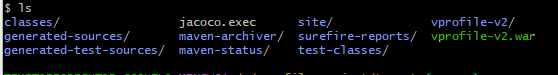

# Project-26: Cloud State with Terraform

[*Project Source*](https://www.udemy.com/course/devopsprojects/learn/lecture/23902642#overview)


# Pre-requisites
* AWS Account
* GitHub account
* Terraform, Maven, JDK installed locally
* Any IDE (VS Code, IntelliJ, etc)

## Step-1: Create a repository in GitHub
- Create a GitHub repo and name it terraform-aws-vprofile. 
- Clone the repository to the VScode.

- Ps: You can make it private repo so as not to expose any Access keys you are using

## Step-2: Terraform Setup

- install `Terraform` and `awscli` locally for this project. You can follow documentation to do so. Install Terraform Install AWSCLI
- Once both are installed, check their version from terminal.


- Create an IAM user `terraadmin` with Programmatic Access, download credentials. configure aws from cli:
```sh
aws configure
AWS Access Key ID : 
AWS Secret Access Key : 
Default region name : 
Default output format: json
```

## Step-3: S3 for Backend
- Create `backend-s3.tf` file under terraform-aws-vprofile repo with below content:
```sh
terraform{
  backend "s3"{
  bucket = "terra-vprofile-state25"
  key =  "terraform/backend"
  region = "us-east-2"
  }
}
```

- Create an s3 bucket to store the state in AWS.
```sh
terra-vprofile-state28
region=us-east-2
```
- Get into the bucket and create a folder `terraform`


- Run `terraform init` to initialize backend from the project directory


## Step-4: Variables and Providers

- Create a HA infrastructure for the vprofile project, create a VPC with 3 Public subnets and 3 Private subnets.
- Create ElastiCache, ActiveMQ and RDS-MySQL services for the application. To be able to create a reusable code, use variables in Terraform code.
- Create `vars.tf` file and `providers.tf` file as in given under terraform-files directory.

 `providers.tf`
```sh
provider "aws"{
  region = var.AWS_REGION
}
```
`vars.tf`
```sh
variable AWS_REGION {
   default = "us-east-1"
}

variable AMIS {
    type = map 
    default = { 
        us-east-1 = "ami-04d1cfb793f6fa37"
    }
}

variable PRIV_KEY_PATH { 
    default = "vprofilekey"
}

variable PUB_KEY_PATH { 
    default = "vprofilekey.pub"
}

variable USERNAME {
    default = "ubuntu"
}

variable myIP {
    default = "102.67.21.239/32"
}

variable rmquser { 
    default = "rabbit"
}

variable rmqpass { 
    default = "Gr33n@pple123456"
}

variable dbuser {
    default = "admin"
}

variable dbpass { 
    default = "admin123"
}

variable dbname { 
    default = "accounts"
}

variable instance_count { 
    default = "1"
}

variable VPC_NAME { 
    default = "vprofile-VPC"
}

variable Zone1 { 
    default = "us-east-1a"
}

variable Zone2 { 
    default = "us-east-1b"
}

variable Zone3 { 
    default = "us-east-1c"
}

variable VpcCIDR {
    default = "172.21.0.0/16"
}

variable PubSub1CIDR { 
    default = "172.21.1.0/24"
}

variable PubSub2CIDR { 
    default = "172.21.2.0/24"
}

variable PubSub3CIDR { 
    default = "172.21.3.0/24"
}

variable PrivSub1CIDR { 
    default = "172.21.4.0/24"
}

variable PrivSub2CIDR { 
    default = "172.21.5.0/24"
}

variable PrivSub3CIDR { 
    default = "172.21.6.0/24"
}
```

## Step-5: Keypairs

Create an SSH key with name of `vprofilekey` as mentioned in `vars.tf file`.
```sh
ssh-keygen
key name : vprofilekey
ls
```


- Create `keypairs.tf` file with below content
```sh
resource "aws_key_pair" "vprofilekey" {
    key_name = "vprofilekey"
    public_key = file(var.PUB_KEY_PATH)
}
```

- Commit/push files to GitHub except private/public key files.
- Install AWS plugins using below commands
```sh
terraform init
terraform validate
terraform fmt
terraform plan
terraform apply
```


## Step-6: VPC Module & Setup
- An easier way to create resources with terraform is using modules. we can find modules in terraform registry VPC module from AWS.
- Create `vpc.tf` file similar to given file under `terraform-files` directory.
```sh
module "vpc" {
  source = "terraform-aws-modules/vpc/aws"

  name = var.VPC_NAME
  cidr = var.VpcCIDR
  azs             = [var.Zone1, var.Zone2, var.Zone3]
  private_subnets = [var.PrivSub1CIDR, var.PrivSub2CIDR, var.PrivSub3CIDR]
  Public_subnets  = [var.PubSub1CIDR, var.PubSub2CIDR, var.PubSub3CIDR]

  enable_nat_gateway   = true
  single_nat_gateway   = true
  enable_dns_hostnames = true
  enable_dns_support   = true 

  tags = { 
    Terraform   = "true"
    Environment = "Prod"
  }
  vpc_tags = {
    Name = var.VPC_NAME
  }
}
```
- Commit/push this file to remote repo.
- Since we added a new module, we need to run the commands below:
```sh
terraform init
terraform validate
terraform fmt
terraform plan
terraform apply
```


## Step-7: Security Groups Setup

- Create SecGrp for the services below:
* Beanstalk Load Balancer
* Bastion Host
* Beanstalk instances
* Backend services (Active MQ - Elasticache - RDS)

- Create `secgrp.tf` file similar to given file under `terraform-files` directory.
Since we added a new module, we need to run the commands below:
```sh
resource "aws_security_group" "vprofile-bean-elb-sg" {
  name        = "vprofile-bean-elb-sg"
  description = "Security group for bean-elb"
  vpc_id      = module.vpc.vpc_id
  egress {
    from_port   = 0
    protocol    = "-1"
    to_port     = 0
    cidr_blocks = ["0.0.0.0/0"]
  }

  ingress {
    from_port   = 80
    protocol    = "tcp"
    to_port     = 80
    cidr_blocks = ["0.0.0.0/0"]
  }
}

resource "aws_security_group" "vprofile-bastion-sg" {
  name        = "vprofile-bastion-sg"
  description = "Security group for bastionisioner ec2 instance"
  vpc_id      = module.vpc.vpc_id
  egress {
    from_port   = 0
    protocol    = "-1"
    to_port     = 0
    cidr_blocks = ["0.0.0.0/0"]
  }
  ingress {
    from_port   = 22
    protocol    = "tcp"
    to_port     = 22
    cidr_blocks = [var.myIP]
  }
}

resource "aws_security_group" "vprofile-prod-sg" {
  name        = "vprofile-prod-sg"
  description = "Security group for beanstalk instances"
  vpc_id      = module.vpc.vpc_id
  egress {
    from_port   = 0
    to_port     = 0
    protocol    = "-1"
    cidr_blocks = ["0.0.0.0/0"]
  }
  ingress {
    from_port       = 22
    protocol        = "tcp"
    to_port         = 22
    security_groups = [aws_security_group.vprofile-bastion-sg.id]
  }
}

resource "aws_security_group" "vprofile-backend-sg" {
  name        = "vprofile-backend-sg"
  description = "Security group for RDS, active mq, elastic cache"
  vpc_id      = module.vpc.vpc_id
  egress {
    from_port   = 0
    to_port     = 0
    protocol    = "-1"
    cidr_blocks = ["0.0.0.0/0"]
  }
  ingress {
    from_port       = 0
    protocol        = "-1"
    to_port         = 0
    security_groups = [aws_security_group.vprofile-prod-sg.id]
  }
  ingress {
    from_port = 3306
    protocol  = "tcp"
    to_port   = 3306
    security_groups = [aws_security_group.vprofile-bastion-sg.id]
  }
}

resource "aws_security_group_rule" "sec_group_allow_itself" {
  type                     = "ingress"
  from_port                = 0
  to_port                  = 65535
  protocol                 = "tcp"
  security_group_id        = aws_security_group.vprofile-backend-sg.id
  source_security_group_id = aws_security_group.vprofile-backend-sg.id
}
```
- Commit/push this file to our remote repo.
- Run the commands below to create SecGrp resources:
```sh
terraform validate
terraform fmt
terraform plan
terraform apply
```


## Step-8: RDS, ElastiCache and ActiveMQ Setup

- Create `backend-services.tf` file similar to given file under terraform-files directory.
`backend-services.tf`
```sh
resource "aws_db_subnet_group" "vprofile-rds-subgrp" {
    name = "main"
    subnet_ids = [module.vpc.private_subnets[0], module.vpc.private_subnets[1], module.vpc.private_subnets[2]]
    tags = {
        Name = "Subnet group for RDS"
    }
}

resource "aws_elasticache_subnet_group" "vprofile-ecache-subgrp" {
    name = "vprofile-ecache-subgrp"
    subnet_ids = [module.vpc.private_subnets[0], module.vpc.private_subnets[1], module.vpc.private_subnets[2]]
}

resource "aws_db_instance" "vprofile-rds" {
 allocated_storage            = 20
 storage_type                 = "gp2"
 engine                       = "mysql"
 engine_version               = "5.6.34"
 instance_class               = "db.t2.micro"
 identifier                   = var.dbname
 username                     = var.dbuser
 password                     = var.dbpass
 parameter_group_name         = "default.mysql5.6"
 multi_az                     = "false"
 publicly_accessible          = "false"
 skip_final_snapshot          = true
 db_subnet_group_name         = aws_db_subnet_group.vprofile-rds-subgrp.name
 vpc_security_group_ids       = [aws_security_group.vprofile-backend-sg.id] 
}

resource "aws_elasticache_cluster" "vprofile-cache" {
  cluster_id            = "vprofile-cache"
  engine                = "memcached"
  node_type             = "cache.t2.micro"
  num_cache_nodes       = 1
  parameter_group_name  = "default.memcached1.5"
  port                  = 11211
  security_group_ids    = [aws_security_group.vprofile-backend-sg.id]
  subnet_group_name     = aws_elasticache_subnet_group.vprofile-ecache-subgrp.name  
}

resource "aws_mq_broker" "vprofile-rmq" {
    broker_name        = "vprofile-rmq"
    engine_type        = "ActiveMQ"
    engine_version     = "5.15.0"
    host_instance_type = "mq.t2.micro"
    security_groups    = [aws_security_group.vprofile-backend-sg.id]
    subnet_ids         = [module.vpc.private_subnets[0]]
  
    user {
    username = var.rmquser
    password = var.rmqpass
  }
}
```
- Commit/push this file to remote repo.

## Step-9: Beanstalk ENV Setup

Create bean-app.tf and bean-env.tf files for environment details
bean-app.tf
resource "aws_elastic_beanstalk_application" "vprofile-prod" {
    name = "vprofile-prod"
}

`bean-env.tf`
```sh
resource "aws_elastic_beanstalk_environment" "vprofile-bean-prod"{
    name = "vprofile-bean-prod"
    application = aws_elastic_beanstalk_application.vprofile-prod
    solution_stack_name = "64bit Amazon Linux 2 v4.1.1 running Tomcat 8.5 Correto 11"
    cname_prefix = "vprofile-bean-prod-domain"
    setting {
        name = "VPCId"
        namespace = "aws:ec2:vpc"
        value = module.vpc.vpc_id
    }
    setting {
      namespace = "aws:autoscaling:launchconfiguration"
      name      = "IamInstanceProfile"
      value     = "aws-elasticbeanstalk-ec2-role"
    }
    setting {
        namespace = "aws:ec2:vpc"
        name      = "AssociatePublicIpAddress"
        value     = "false"
    }

    setting {
        namepsace = "aws:ec2:vpc"
        name      = "Subnets"
        value     = join(",",[module.vpc.private_subnets[0],module.vpc.private_subnets[1],module.vpc.private_subnets[2]])
    }
    setting {
        namepsace = "aws:ec2:vpc"
        name      = "Subnets"
        value     = join(",",[module.vpc.public_subnets[0],module.vpc.public_subnets[1],module.vpc.public_subnets[2]])
    }

    setting {
        namepsace = "aws:autoscaling:launchconfiguration"
        name      = "InstanceType"
        value     = "t2.micro"
    }

    setting {
        namepsace = "aws:autoscaling:launch configuration"
        name      = "EC2keyName"
        value     = aws_key_pair.vprofilekey.key_name
    }

    setting {
        namepsace = "aws:autoscaling:asg"
        name      = "Availability Zones"
        value     = "Any 2"
    }
    setting {
        namepsace = "aws:autoscaling:asg"
        name      = "MinSize"
        value     = "1"
    }
    setting {
        namepsace = "aws:autoscaling:asg"
        name      = "MaxSize"
        value     = "8"
    }

    setting {
        namepsace = "aws:elasticbeanstalk:application:environment"
        name      = "environment"
        value     = "prod"
    }
    setting {
        namepsace = "aws:elasticbeanstalk:application:environment"
        name      = "LOGGING_APPENDER"
        value     = "GRAYLOG"
    }
    setting {
        namepsace = "aws:elasticbeanstalk:healthreporting:system"
        name      = "SystemType"
        value     = "enhanced"
    }
    setting {
        namepsace = "aws:elasticbeanstalk:updatepolicy:rollingupdate"
        name      = "RollingUpdateEnabled"
        value     = "true"
    }
    setting {
        namepsace = "aws:elasticbeanstalk:updatepolicy:rollingupdate"
        name      = "RollingUpdateType"
        value     = "Health"
    }

    setting {
        namepsace = "aws:elasticbeanstalk:updatepolicy:rollingupdate"
        name      = "MaxBatchSize"
        value     = "1"
    }
    setting {
        namepsace = "aws:elb:loadbalancer"
        name      = "CrossZone"
        value     = "true"
    }

    setting {
        namepsace = "aws:elasticbeanstalk:application:environment"
        name      = "StickinessEnabled"
        value     = "true"
    }
    
    setting {
        namepsace = "aws:elasticbeanstalk:command"
        name      = "BatchSizeType"
        value     = "Fixed"
    }

    setting {
        namepsace = "aws:elasticbeanstalk:command"
        name      = "BatchSizeType"
        value     = "1"
    }
    setting {
        namepsace = "aws:elasticbeanstalk:command"
        name      = "DeploymentPolicy"
        value     = "Rolling"
    }

    setting {
        namepsace = "aws:autoscaling:launchconfiguration"
        name      = "SecurityGroups"
        value     = "aws_security-group.vprofile-prod-sg.id"
    }

    setting {
        namepsace = "aws:elbv2:loadbalancer"
        name      = "SecurityGroups"
        value     = "aws_security_group.vprofile-bean-elb-sg.id"
    }

    depends_on  = [aws_security_group.vprofile-bean-elb-sg,aws_security_group.vprofile-prod-sg]
}
```
- Run the commands below 
```sh
terraform validate
terraform fmt
terraform plan
terraform apply
```

## Step-10: Bastion Host & DB Initialization
- Create a `Bastion host` then connect to RDS instance through this instance and initialize the Database.
- Use the `templatefile` function to initialize RDS. You may check out more about this function from documentation
- Replace  RDS-endpoint as an environment variable after it is created in template file to be able to connect to mysql database.
- Create `templates` directory in project, under the same directory create a file named as `db-deploy.tmpl` with the content below:
```sh
sudo apt update
sudo apt install git mysql-client -y
git clone -b vp-rem https://github.com/devopshydclub/vprofile-project.git
mysql -h $(rds-endpoint) -u $(dbuser) --password=$(dbpass) accounts --ssl-node=DISABLED < /home/ubuntu/vprofile-project/src/main/resources/db_backup.sql
```

- Create `bastion-host.tf` file similar to given file under `terraform-files` directory.
```sh
resource "aws_instance" "vprofile-bastion" {
  ami                    = lookup(var.AMI, var.AWS_REGION)
  instance_type          = "t2.micro"
  key_name               = aws_key_pair.vprofilekey.key_name
  subnet_id              = module.vpc.public_subnets[0]
  count                  = var.instance_count
  vpc_security_group_ids = [aws_security_group.vprofile-bastion-sg.id]

  tags = {
    Name    = "vprofile-bastion"
    PROJECT = "vprofile"
  }

  provisioner "file" {
    content     = templatefile("templates/db-deploy.tmpl", { rds-endpoint = aws_db_instance.vprofile-rds.address, dbuser = var.dbuser, dbpass = var.dbpass })
    destination = "/tmp/vprofile-dbdeploy.sh"
  }

  provisioner "remote-exec" {
    inline = [
      "chmod +x /tmp/vprofile-dbdeploy.sh",
      "sudo/tmp/vprofile-dbdeploy.sh"
    ]
  }

  connection {
    user        = var.USERNAME
    private_key = file(var.PRIV_KEY_PATH)
    host        = self.public_ip
  }
  depends_on = [aws_db_instance.vprofile-rds]
}
```
- Commit/push this file to remote repo.
- Run below commands 
```sh
terraform validate
terraform fmt
terraform plan
terraform apply
```


## Step-11: Artifact Deployment

- Clone the repository below, and make updates in `application.properties` file.
```sh
git clone https://github.com/devopshydclub/vprofile-project.git
git checkout vp-rem
ls
cd src/main/resources/
vim application.properties
```
- Update the contents below in the file. 
* Replace db01 -> RDS endpoint 
* Replace mc01 -> ElastiCache endpoint 
* Replace rmq01 -> Active MQ AMQP endpoint(only take URL after //) and port RabbitMQ. 
* Username=rabbit 
* Password= <replace with the password in vars.tf>
```sh
#JDBC Configutation for Database Connection
jdbc.driverClassName=com.mysql.jdbc.Driver
jdbc.url=jdbc:mysql://db01:3306/accounts?useUnicode=true&characterEncoding=UTF-8&
#Memcached Configuration For Active and StandBy Host
#For Active Host
memcached.active.host=mc01
memcached.active.port=11211
#For StandBy Host
memcached.standBy.host=127.0.0.2
memcached.standBy.port=11211
#RabbitMq Configuration
rabbitmq.address=rmq01
rabbitmq.port=5672
rabbitmq.username=test
rabbitmq.password=test
```
- Save and exit, go to project directory where `pom.xml` exists and run `mvn install` to generate our artifact.
```sh
cd ../../..
ls
mvn install
```

- Now that the artifact is ready, upload it manually to beanstalk.
```sh
ls
cd target/
ls
```


- Go to Beanstalk from AWS Console, click on application you created by terraform. `Upload and Deploy`


## Step-12: Validate and Cleanup

- Validate the application from browser, click on URL given in Beanstalk page.


- Run command below to clean-up your AWS account.
```sh
terraform  destroy
```